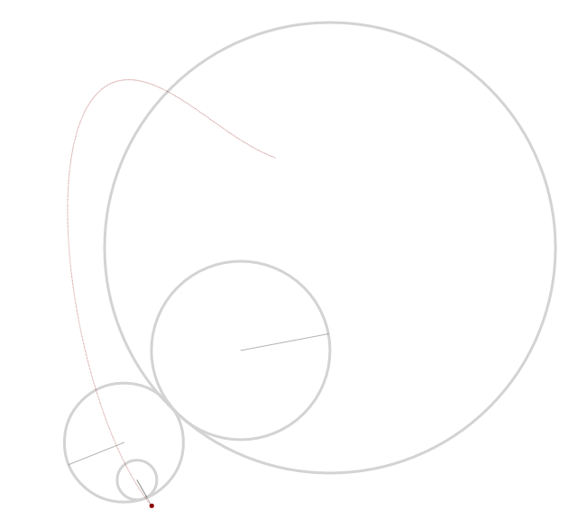
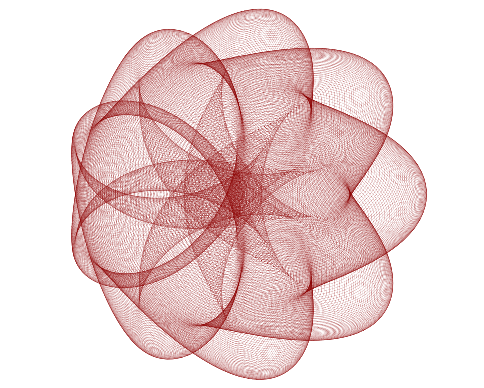
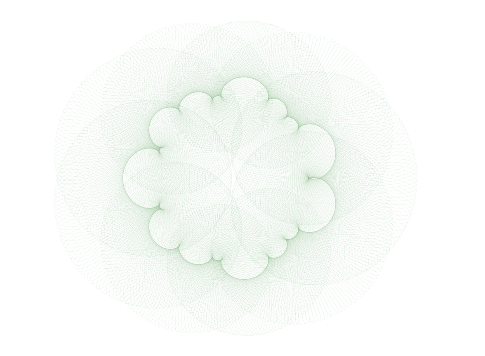
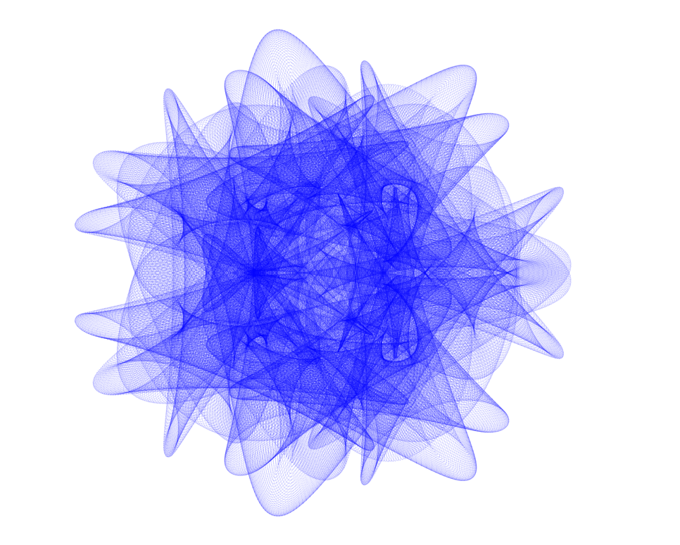
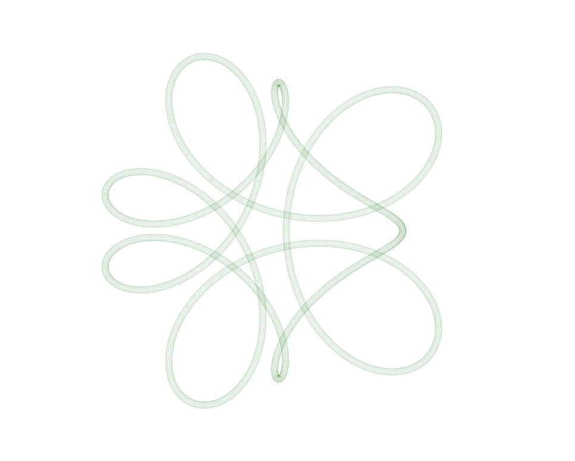
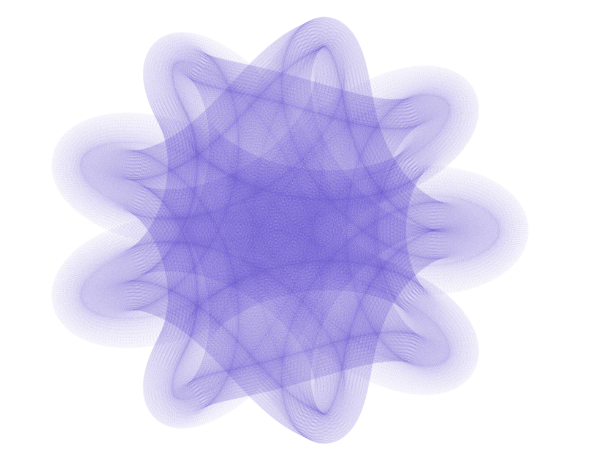

# Spirograph&#8319;
Based on the classic Spirograph toy.

[Visit Spirograph&#8319; at SeedCode](http://seedcode.com/SpirographN/sgn.html)

A Javascript drawing app, using canvas, where you can add/nest *n* number of gears (rotors) leading to endless possibilities of complex shapes and patterns.

Unfortunately, the canvas line rendering on Safari is not precise enough to get all the details in the more complex shapes. Chrome gives the best results.

##Spirograph&#8319; in action

##Sample Drawings Created with Spirograph&#8319;

[http://seedcode.com/SpirographN/sgn.html?pre=true%20love](http://seedcode.com/SpirographN/sgn.html?pre=true%20love)

[http://seedcode.com/SpirographN/sgn.html?pre=lily%20pad](http://seedcode.com/SpirographN/sgn.html?pre=lily%20pad)

[http://seedcode.com/SpirographN/sgn.html?pre=habitrail](http://seedcode.com/SpirographN/sgn.html?pre=habitrail)

[http://seedcode.com/SpirographN/sgn.html?pre=pufferfish](http://seedcode.com/SpirographN/sgn.html?pre=pufferfish)

[http://seedcode.com/SpirographN/sgn.html?pre=tubular](http://seedcode.com/SpirographN/sgn.html?pre=tubular)

[http://seedcode.com/SpirographN/sgn.html?pre=burgess%20shale](http://seedcode.com/SpirographN/sgn.html?pre=burgess%20shale)

[http://seedcode.com/SpirographN/sgn.html?pre=dark%20knight](http://seedcode.com/SpirographN/sgn.html?pre=dark%20knight)

##Developed By Dr. S

